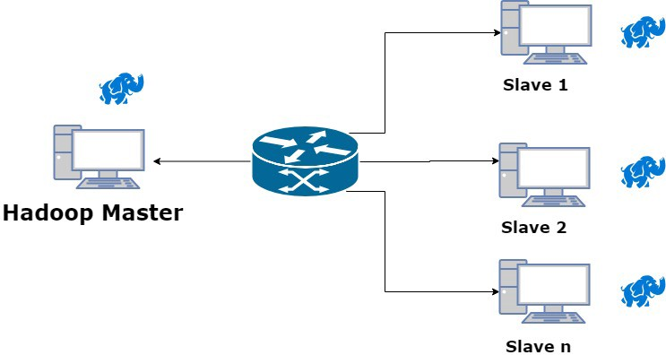
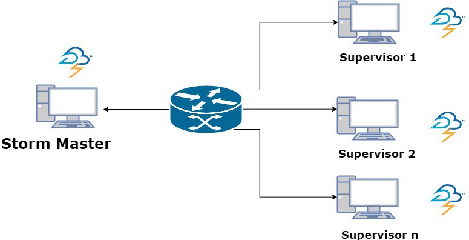
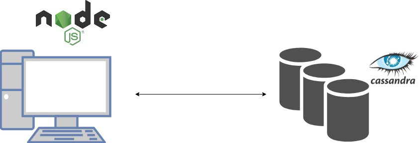
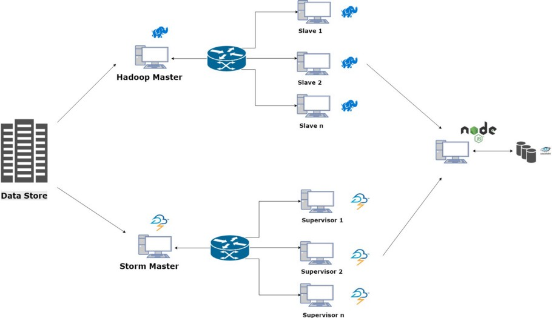

How we went on building a product which can handle a huge amount of incoming data and process it online.

Hi Everyone,

I am here to talk about one of the projects that I did at my college. I took up this project during the final year of engineering at IIT J. This project is actually very different compared to other projects that I had done until then(which includes web development, NLP, Machine Learning etc.). We were a team of two. We had our fair share of difficulties and hurdles on the way. But that’s where the learnings come from 😃.

### Problem Statement:

Handling inflow of huge amount of data and processing it online.

Let’s try to visualise the problem statement with a use case.

Consider an academic institution such as mine. When some student wants to perform data processing for her project on some huge amount of data, it is very tough to do it on her single computer/laptop due to the resource limit. We are talking data of terabytes and petabytes scale. So doing the processing on a single computer will take forever. We want to develop a solution for this pro­blem. The commodity PCs at the computer laboratory can be used to distribute the task in hand. We want to develop a system so generic which will perform the desired job on the huge incoming data by processing it online. We also want it to be fault tolerant at all times. There are plenty of tools that do distribute computing but rarely there are such systems for this context.

So let’s say we have an incoming stream of images and the developer wants to run some classification algorithm over those images. The result of this classification should be written in a database for online queries. Running the desired job on each piece of data(here classification of images) linearly will take forever.

Can we distribute the classification task to more computers and aggregate the result when the job is done?

[Lambda Architecture(LA)](http://lambda-architecture.net/) is one such solution. Nathan Marz described lambda architecture as a robust, scalable, generic, distributed system. Let’s talk about how LA handles this. Please bear with me. It will be worth it 😇.

### What is Lambda Architecture

It all begins with data. Data of any type e.g. logs from a mobile application, location pings, images, audio, videos, banking transaction. The raw data is stored in the data centres. On top of that various operations are performed. LA makes two assumptions on the data. The assumption on this data is that it is online and it is immutable. The former online, here means that we are appending the new data at the end of existing data. The latter term immutable, means we are not changing any data at any point in time. Updates are replaced by new writes. I’ll justify these assumptions in a while.

Now you have queries on the data (the whole dataset). Literally running a function on the complete dataset has latency constraints as dataset size grows. For the time being let’s assume we are able to compute our function quickly on complete dataset. Talking about CAP theorem, partition tolerance is a necessity and not an option. So the tradeoff is between consistency and availability. Nathan Marz, proves in his work, that how mutable data and CAP theorem don’t play well together (the complexity of read-repairs). However, if we remove the updates by new writes there won’t be any divergent values at any point in time. So we will be able to achieve eventual consistency along with availability. CAP theorem has been beaten.

Talking about eventual consistency, we assumed that our function runs quickly on the entire dataset. This can be achieved by using a data system which can easily store large and constantly growing dataset and can compute the function in a scalable way.

To get results quicker, we can precompute the batch views and store in a database. This database can be indexed on the timestamp for quicker queries.

The only drawback that can arise here as the data grows is that the queries are out of date by a few hours. There will be eventual consistency. All that is left to do is to compensate for the last few hours of data. Nathan proposes a real-time system that computes the query on the last few hours of data for which batch view has not been calculated. This can be done quickly. So to finally answer a query on the whole dataset, we can merge the results from batch view and real-time view. The last few hours of data are again sent to batch layer for batch view precomputation. Let’s understand this approach with an example:

Let’s say you have 100 GB of images so far and the data is ever increasing. You compute you classification job on this whole dataset in let’s say ~5 hrs. You have written the result of this computation in a dataset indexed with the timestamp. Now say 10 MB of new images have arrived. Recomputing the classification job on 100GB+10MB will again take ~5 hrs. This will be really an inefficient way of handling the data and queries since you’ve precomputed the result on 100GB earlier.

### How does Lambda Architecture work?

We can process the existing data in a batch processing framework(e.g Apache Hadoop), writing the result of the classification job in a database. So we have precomputed the batch view. The new incoming data can be processed inside a real-time processing framework(e.g. Apache Storm) and the result could again be written in a separate database. When a user queries about the job on the whole dataset, we can show results of the precomputed batch views aggregated with real-time views quickly. The new data can be sent again to the batch layer to be appended and job to be recomputed in the background on the new batch view. That way we have distributed the job among many computers and answering queries quickly.

### Building Blocks of Freya

Freya extends this same idea in our context. You give it some computers with Ubuntu installed on them connected in a network. It will set up the batch layer and real-time layer along with a database gateway to query on the data. We used Apache Hadoop for the batch layer and Apache Storm for the real-time layer.

The batch layer of Freya is a master-slave Hadoop architecture. Master node runs the NameNode and the slave nodes act as DataNodes. Here is a diagram describing this architecture:

The real-time layer of Freya is also master-slave Storm architecture. Master node runs the Zookeeper server, Nimbus, UI and supervisor and the slave nodes act as supervisor nodes. Here is a diagram describing this architecture:

The database gateway is a Node.js app which exposes various API endpoints to query the databases for the result of the job performed on the whole dataset.

So overall we have an aggregation of these different components as the final product. Of course, it is not the best solution as it has its own limitations. For example, we have increased the number of point of failures. But given the optimization in terms of time that we are getting here is remarkable.

### Merits and shortcomings of Freya

Some good things about Freya:

- Since the input data is never modified, it makes huge map reduce jobs tractable. The jobs are easy to control and each stage in the job can be debugged easily.

- The code keeps changing. The jobs keep changing. It may be because of bugs or requirement changes or other reasons. But Freya(since it is based on top of LA) is resilient to this change. Batch processing deals with this problem easily by re-computing.

There are some shortcomings as well.

- The duplicative development effort in building hot(real-time) and cold(offline) paths of their processing pipeline. The additional overhead of reprocessing the data in the batch layer which were processed in the stream layer. The overhead of merging the results of both layer also counts as developer overhead.

- Maintaining the code that produces the same result in every complex distributed framework. There are many points of failures.

- Operational overhead is high for maintaining, running and debugging two systems simultaneously.

So why use Freya depends on the use case. In our case, lambda architecture is best-fit considering the academic use cases. So operational overhead is considerably low. Also, the nodes are physically located in one place. So it’s easy to debug and the infrastructure is less network error prone.

We have tried to achieve automation to the greatest extent possible. With Freya, your in-house LA will be up and running within minutes ✌️. Below is a demo.

<iframe width="560" height="315" src="https://www.youtube.com/embed/ccbEO9abQpw" frameborder="0" allow="accelerometer; autoplay; encrypted-media; gyroscope; picture-in-picture" allowfullscreen></iframe>

### Setting up Freya

The code for Freya is on [Github](https://github.com/rashi-sahu/Freya). This project would not have been successful without the contributions of my project partner [Rashi](https://github.com/rashi-sahu) and guidance of our mentor [Dr Sumit Kalra](https://www.linkedin.com/in/sumit-kalra-97a06933/). I am thankful to them for their inputs. We are thinking of adding more features and bringing it to the usage of the common.

---

Thanks for reading !!! Feel free to connect with me on [Twitter](https://twitter.com/whoAbhishekSah) for any conversations.
