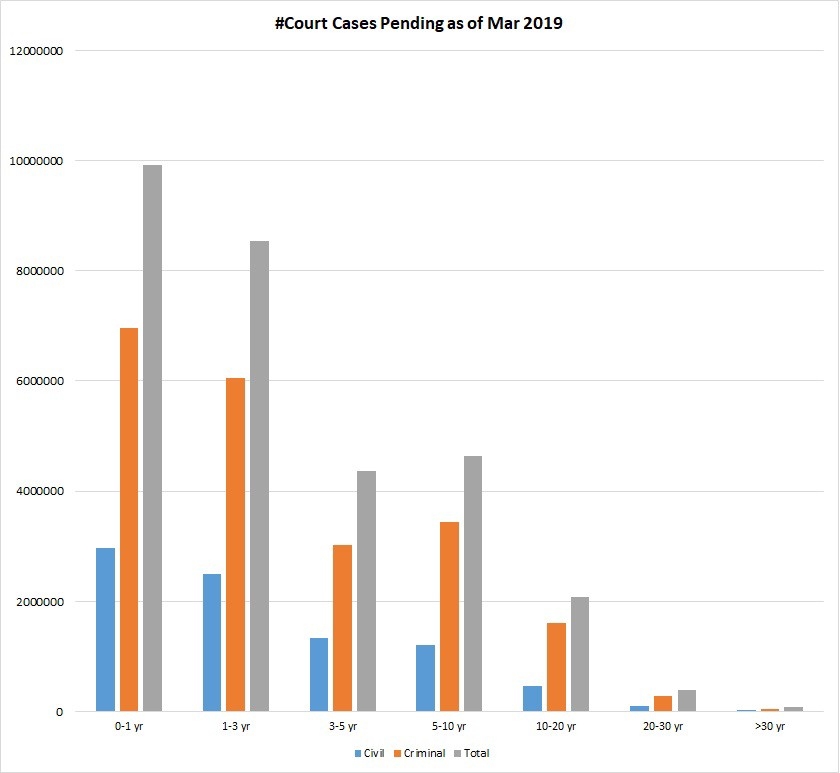
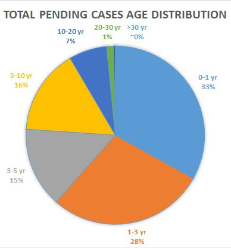
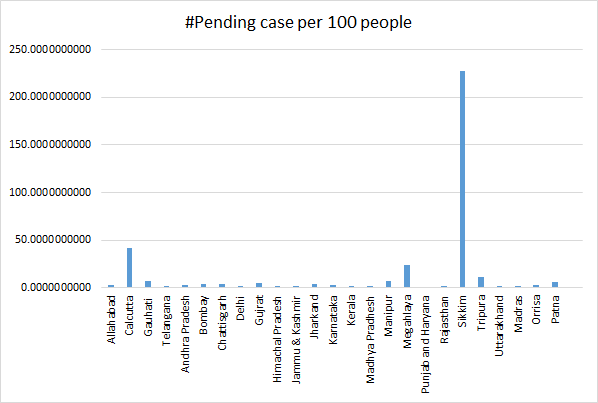

India is a vast country. It’s the second-largest in terms of population and the largest democracy in the world. But the Indian judiciary has not performed well in recent years. The judiciary (also known as the judicial system, judicature, judicial branch or court system) is the system of courts that interprets and applies the law in the name of the state. The judiciary can also be thought of as the mechanism for the resolution of disputes. Judiciary is the institution which protects the rights of citizens in a democracy. So it somewhat ensures social sustainability in a society(and hence nation).
There are more than 3 crore cases pending in the courts of India. The situation is worse than ever. The Chief Justices of India have constantly declared their concerns on this in recent years. It is one of the issues that need concerned authorities immediate attention. Otherwise, the nation will fail to build the very foundations of a sustainable society.

### An overview of the courts and court cases in India

There are three levels of courts in India. The district and session courts, the High Courts and the Supreme court of India. All of the courts have their proper roles assigned as per the constitution. The judges are there to resolve all the cases arriving in their courts. The cases can be categorized into three main categories:

- Civil Cases: Civil cases involve conflicts between people or institutions such as businesses, typically over money. A civil case usually begins when one person or business (the “plaintiff”) claims to have been harmed by the actions of another person or business (the “defendant”) and asks the court for relief by filing a “complaint” and starting a court case.

- Criminal Cases: A crime is always considered a crime against society, never against just the victim. So, there will be a police investigation. It will be the Prosecutor (The government) which will charge the accused and the victim shall not get to appoint a lawyer of his choice. It will be the government’s lawyer who will fight it. For example, the State of Maharashtra v/s Ajmal Kasab. The reason why ‘The State of Maharashtra’ comes into the picture is that crime is always considered as a crime against the entire society.

- Writ Cases: A writ is a formal written order issued by a Court. Any warrant, orders, directions, and so on, issued by the Supreme Court or the High court are called writs. A writ petition can be filed in the High Court (Article 226) or the Supreme Court (Article 32) of India when any of your fundamental rights are violated.

#### The present situation of pending cases

As per the data collected from the National Judicial Data Grid, there are more than 3 crore cases pending in all the courts of India. Approximately 43 lakh cases are pending in the High Courts of India and 65,000 in the Supreme court of India. There are cases which are pending for years (even 10+ years). India is facing such a serious threat to social security. It is no less of a concern to every citizen. There is a saying that “justice delayed is justice denied”. The data clearly shows how many people have been, denied justice, due to the improper functioning of the judiciary. The below graph shows the pending cases in Indian courts. On the vertical axis is the count of cases and on the horizontal axis is the time for which the cases are pending.

Out of the 3 Crore pending cases, 58% comes under the category of criminal cases and 42% under civil cases. Both types of cases have a different procedure of handling and so different problems are associated with them. If we look at the percentage-wise distribution on the age-group of pending cases, the data is rather shocking.

Considering the new cases to be those under 5 years of age, from the above figure, it can be seen that more than 60% of the pending cases are new. It also shows the awareness among the citizens of his/her fundamental rights. People are more aware than ever. The count shows that people are reaching the courts for justice in higher numbers. This puts a burden on the judiciary.

#### Pending cases in different high courts

The high courts are the principal civil courts of original jurisdiction in each state and union territory.

The Allahabad High court has the most number of pending cases. The shocking count of more than 7 lakh pending cases raise serious questions on the present and previous state governments of Uttar Pradesh. These figures somewhat show the ground reality of social sustainability in different states of India. Rajasthan being second and the High court of Punjab and Haryana also reflect the societal conditions. The below graph shows the percentage-wise distribution of pending cases in various states of India.

On the other hand, there is a good side to this data. It can be seen that in the easternmost part of India, the states which are known as the seven sisters, are performing well when it comes to pending court cases but their population is also low compared to other states like Uttar Pradesh, Punjab, Haryana etc. A better insight would then be normalisation with respect to population of the states. See the chart below:

Clearly, Sikkim has the worst condition. Per 100 person, there are 227 pending cases, while Kolkata stands second in this parameter.

### What actions have been taken in this regard

We can see that there is no one size fits all condition. India is a very diversified country culturally and economically. The problems faced by citizens in eastern India is very different than in the north. So the state and central government need to take different actions for different states. Proper feedback needs to be taken from the concerned authorities. A top-down approach will uproot the problem of pending cases.

It also boils down to the problem of demand and supply. There is a demand for judges in all type of courts in India. But the recruitment process is almost dead. There have been several initiatives to recruit judges in an efficient manner. Several proposals were made like involving UPSC or another central agency may be in conducting the test, separately for district judges and subordinate court judges, in states and Union Territories, with due importance given to local languages for those opting for a particular state, on the lines of NEET held by the CBSE for medical students. It was also proposed for an all-India merit list to be prepared based on the proposed central selection mechanism.

The initiative has got fresh impetus after CJI Ranjan Gogoi expressed his desire to fill up all judges’ posts immediately to bring down the huge pendency of cases in district and subordinate courts. At present, all appointments of judges in district and subordinate courts are in the domain of state governments and high courts concerned. Inordinate delays in holding a regular examination for recruitment of judicial officers for lower courts have led to huge vacancies. Though not all states and HCs are on board on the creation of the central mechanism, the CJI seems to have expressed willingness to go ahead with the as a one-time measure to fill up all vacancies and reduce pendency, sources said. The appointments will finally be made by the respective state governments based on the all-India merit list and HCs will have administrative control. The central selection mechanism is also intended to bring in uniformity in the appointment of judicial officers across the country.

### Reasons behind huge pending cases in Indian courts

For what reason are such a large number of cases pending in Indian courts? Somewhere around 5 Cr cases are documented each year and arrangement of judges is of just 2 Cr. The reasons being:

## Increase in the awareness of rights

The number of cases being filed every year is increasing because of awareness towards justice increasing among people as literary rate increasing. The ongoing financial advances and the resultant consciousness of lawful rights, has offered boldness to ordinary citizens to approach official courtrooms for equity. For example, Kerala gets 28 new cases for every 1,000 individuals. It has an education rate of over 90%. Jharkhand, which has a proficiency rate of around 53%, gets four cases for each 1,000. It is a good thing, that people become more aware of their rights. Education provides them with the boldness to raise voice against things they find wrong.

## New mechanisms like PIL and RTI

As the government explicitly made legislation for new rights like “Right to Information” and “Right to Education”, aggrieved parties started to increasingly knock the doors of justice. Likewise, a dynamic legal executive has imagined new gadgets like “Public Interest Litigation” which gave again brought about more cases.

## Inadequate judges

There are insufficient judges (just around 21,000). Current judge to population proportion is 10 to 1 million. The Law Commission report in 1987 prescribes at least 50 to 1 million. The population has expanded by more than 25 Cr since 1987. To remove the insufficiency of judges The Center Govt. says the States Govt. should take the lead in increasing the number of judges and the States Govt. says Center Govt. should take the lead. As this tug of war goes on, the judge’s strength continues as before and prosecutors stay in jail.

More than half of the posts are vacant. There is a contention among Judiciary and Executive in regards to the appointment of Judges to Supreme Court and different High Courts. Colonial legacies like paid long vacations at a time when the number of judges is low, the appointed judges are taking long vacations, particularly in High Courts. These all lead to the reason for pending cases. The government needs to employ new judges to the courts.

## Inadequate courts

Our judiciary has inadequate resources. Doesn’t have enough infrastructure, official buildings, etc. Both Central and States Government are not interested in increasing spending with respect to the judiciary. The Financial allocations for the whole judiciary are a pitiful 0.1% to 0.4% of the whole budgets. India needs more courts and more benches. Modernization and computerization have not reached all courts. The government need to come up with solutions to use technology for making courts more adequate.

## Low judicial quality in lower courts

Most of the cases are first heard in the lower courts and the number of cases which are referred to higher courts from lower courts for revisiting the cases is also high and one big reason for it is lack of trust of peoples on lower courts. In some cases, offenders appeal to higher courts just to delay his punishment. The quality of judges in lower courts is average and judicial is failed to pull the best talent into the legal executive. lower salary of officials in lower courts is also one of the reasons for it. Corruption is rooted in lower courts postponing dates and bribes for bail is also seen much time. To remarks these things former chief justice of India V. N. Khare said in an interview, “Judges are only human, like us. They come from the same society. Our society is all about quick successes. Short cuts are taken. Even by the judges.” Lack of experience and expertise of judicial officer in Lower courts to dispose of cases quickly is also one of the reason.

---

Thanks for reading this review on Indian judiciary. Feel free to connect with me on [twitter](https://twitter.com/whoAbhishekSah) for any conversations on this or comment below.
