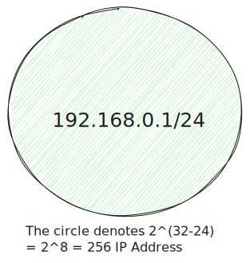
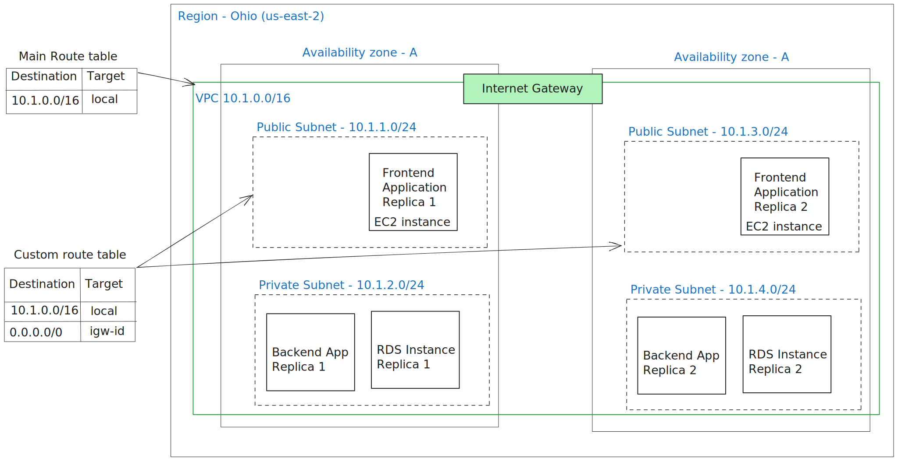

Computer networking is a fascinating concept. Networking is how you connect computers worldwide to let them communicate with each other. The computers talk to each other as per the networking rules applied to them. This article will take you through the administration of computer networks in AWS Cloud.

## VPC

A Virtual Proud Cloud(VPC) is an isolated network that you can create in your AWS account, similar to a physical computer network (like LAN etc.). It is logically isolated from other virtual networks in the AWS Cloud.

There are three important aspects to any VPC:

1. Name of the VPC
2. Region: A VPC spans all Availability zones within the region.
3. Size: A continuous block of IP address represented using CIDR notation. CIDR notation is a mathematical way to represent blocks of IP addresses. [CIDR Ranges](https://en.wikipedia.org/wiki/Classless_Inter-Domain_Routing#CIDR_blocks)

With these three inputs, AWS will create a network consisting of IP addresses. You can think of the network as a virtual boundary where your resources will be deployed.

By default, all these IP addresses are private, which means they can’t be accessed from outside the network, but resources inside the boundary can access each other. The first usable IP address in this range is: 192.168.0.1 We will look into architecting the VPC to create network topologies of our choice.

To allow internet connectivity to your VPC, you must create an internet gateway(referred to as IGw hereon). It’s a highly available and scalable utility that allows traffic from the internet to reach resources in your VPC. Each IGw has a unique ID in AWS.

### Subnet

A subnet is a network inside the VPC. Think of it like a chunk of the “VPC pie” shown above. It is a continuous block of networks contained inside the VPC.

For example 192.168.0.1/26 represents a total of 64 IP addresses in the (usable)range 192.168.0.1 to 192.168.0.62

Subnets can be used to isolate and optimize network traffic. Subnets can also be used to provide high availability and connectivity options for your resources. The kind of traffic that can get in and out of any subnet is decided using certain privacy rules. The set of rules are represented as “Route Tables”.

In AWS, any subnet has three major aspects:

1. The VPC it belongs to
2. The availability zone
3. CIDR block

## Route Tables

External traffic reaches inside the VPC via an IGw. But for the traffic to reach the right resource within VPC, we need to route it to the right network(subnet). That’s where Route tables come into the picture. Route tables decide the routing of traffic within a VPC. For example, to allow traffic from IGw to a subnet - there must exist a route from the IGw to the subnet.

The classification of a subnet as either public or private is determined by the type of routing table to which they are linked. Route tables can be applied at the subnet level or VPC level. Hence resources that must be connected to the internet, should be created inside a public subnet. Similarly, resources that must not be connected to the internet, should be placed inside a private subnet.

Here is an example route table:

| Destination | Target |
| ----------- | ------ |
| 0.0.0.0/0   | igw-id |
| 10.1.0.0/16 | local  |

Any route table has no meaning unless it gets attached to a network (i.e. Subnet). Each row in this table is called a route that determines where network traffic is directed. The first column represents the destination - the sources of traffic, and the second column represents the medium.

So inside the table shown above, the first row implies the following :

`0.0.0.0/0` represent traffic that can be taken from any source (meaning all IP address in the universe) via the internet gateway should be routed inside the subnet this route table is attached to.

The second row implies: Only traffic belonging to the `10.1.0.0/16` range should be routed to the subnet this route table is attached to. **local** is a special target that means traffic from other subnets within the same VPC.

AWS route tables support many different types of targets such as NAT Gateway, Network Interface, Peering connection, outpost local gateway, virtual private gateway etc.

Each VPC comes with a default route table called the **Main Route Table** attached to it. The following describes the content of the Main Route table. For our VPC shown in the image above, the Main Route Table will contain the following two rows:

| Destination    | Target |
| -------------- | ------ |
| 192.168.0.1/24 | local  |
| 0.0.0.0/0      | igw-id |

AWS assumes you want traffic to move between your resources created in the VPC hence the first entry is created by default. The second entry specifies traffic from the Internet can reach the VPC.

## Architecting VPCs

AWS creates VPC for us in every region by default. When you create a new AWS account, you get a default VPC. Default VPCs provide a way to properly access the EC2 instances over the internet. For your usage, you can select the default VPC or build a custom VPC on your own. The custom VPC could be more secure and provide granular options as you can control the configuration of the subnets and their route tables.

A default VPC comes with a public subnet in each Availability Zone, an internet gateway, and settings to enable DNS resolution. Therefore, you can immediately start launching Amazon EC2 instances into a default VPC - it’s designed to fast-track the simple use cases. The default VPC provisions the CIDR range, subnets and gateway for you. The following is a list of configuration AWS sets for your default VPC:

- Creates VPC of size `/16` IPv4 CIDR block (`172.31.0.0/16`). This provides up to 65,536 private IPv4 addresses.
- Creates default subnet of size `/20`  in each Availability Zone. This provides up to 4,096 addresses per subnet, a few of which are reserved for AWS use.
- Creates an Internet Gateway and connects it to default VPC - so by default your VPC has internet access.
- Adds a route to the main route table that points all traffic (`0.0.0.0/0`) to the internet gateway.
- Adds a route to the main route that allows inter-subnet traffic

Once the VPC is created, you should create subnets that let you decide the visibility of the IP addresses to the outside world. In the following section, we will deploy a sample application to see all the components in action.

## AWS Networking in action

Our application is a movie directory consisting of a frontend that shows a catalogue of movies in a web-based interface and a database that has some movies stored along with relevant tags and metadata(such as director name, release year, genre, etc.). We want to deploy the frontend and backend on separate EC2 machines where only the frontend should be accessible from the public internet. Let’s begin with a basic organization of resources inside AWS VPC.

At the topmost level - we have the US-east-2 region being represented with two availability zones. Let’s go through what we’ve done in the above diagram:

- We created a VPC denoted by 10.1.0.0/16 and added an Internet Gateway to it
- The VPC is split into 4 equal size subnets. In each availability zone, we will have two subnets, one public and one private. The Public subnets will have a custom route table associated which allows a route from 0.0.0.0/0 via the Internet Gateway. Any resource that should be reachable from outside the VPC should be placed inside this subnet.
- For high availability, we host two replicas of each instance(frontend, backend and database). The replicas are dispersed in different availability zones. So in case, an availability zone goes down, our application remains reachable to users.
- We want only frontend replicas to be reachable from the internet. Hence, frontend replicas are put inside Public Subnets. Backend and Database replicas are placed inside a Private subnet. Frontend replicas can reach resources in the private subnet with the help of route table entry `10.1.0.0/16` via the `local` target.