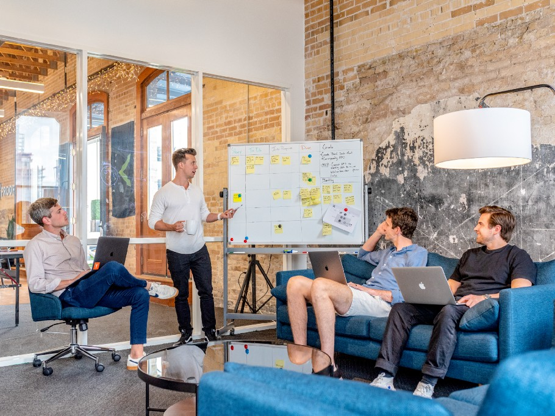

At Gojek, fresh graduates go through a rigorous two months Bootcamp programme. The Bootcamp is structured in several modules. The first of these modules are core engineering. Here I will introduce you to some of the main themes of the core engineering module. Let’s dive in!

### How to make decisions, quickly!

An engineer is supposed to make many decisions every day. Decisions can be of many aspects ranging from how to name a variable to what should be the road map of the team for the upcoming days and months. This is a problem that we face several times a day. You can’t just take any decisions. You have to have some reasoning behind it. You must do some analysis of alternatives. Sometimes you have to convince your teammates about your approaches to a problem(what decision you took)! Here come the issues when you have to explain everyone and convince them.

You need to develop many soft skills. No matter how smart you are or how great a programmer you are, but if you cannot communicate properly and if you cannot explain complex things to people in simple English, you are going to find it very hard to deal with people, every day.

Photo by [Austin Distel](https://unsplash.com/@austindistel?utm_source=medium&utm_medium=referral) on Unsplash

### Time is the most important factor

Time is one of the most valuable resources for everyone in the office. So if you are making a conversation in your team, you need to be good enough to express your thoughts clearly and quickly. You need to learn how to speak clearly. In the Bootcamp, we go through a rigorous speaking drill where we practice how to be a good speaker and a good listener. Here I have learned how to convey your thoughts to your audience. An engineer has to deal with a wide range of audience working across different teams. For example, at Gojek, a product engineer may need to talk to Product Managers, Tech Leads, other engineers, business intelligence team, operations team, system engineers, peoples partner etc. There is a different level of engagement needed for different people. You need to put your words differently to be able to convey your message correctly and quickly.

### Be fallacy free

Most of us fall in the trap of logical fallacies in our arguments. In the Bootcamp, we practice rigorously in speaking drill to make our arguments free from [logical fallacies](https://owl.purdue.edu/owl/general_writing/academic_writing/logic_in_argumentative_writing/fallacies.html). We practice hard to inculcate the habit of making fallacy free arguments to sound convincing. Developing such speaking habits makes us reach an agreement in our arguments.
Of course, you will need your technical expertise in making decisions on a daily basis. But it’s not just about being technically sound, to be a great software engineer. It’s about those aspects of software development which are not taught in any university, the soft skills.

### Baby Steps

The baby steps are about taking small steps to build the solution of a complex problem iteratively. Most of the time you don’t know prior to solving the problem what the solution is going to look like. In complex engineering areas, such as ours, most of the time we can’t say for sure for example how the service or app will look like in the end. There are many variables.

For example, the customer requirements are not clear initially or the scale is unknown or you are not sure about the approach etc. Baby steps help in these cases. In the core engineering Bootcamp, we develop the habit of taking baby steps in solving some problem because that way we will be able to solve some immediate problem which will, in turn, help you solve the bigger problem. This way you will do frequent commits. Baby steps should be visible on your commit history and not only on pen and paper. Test-driven development helps you take baby steps as you start seeing the bigger problem in smaller chunks of testable behaviours.

### Being a team player

You are not going to work alone. You will always work in a team. We learn the principles of how to work in a team. In the Bootcamp, we also have a team of boot campers. We learn the process required to work effectively in a team. It introduces us to the most basic things in a team, for example, conventions, wiki, communication channel, stand up meetings, timings, objectives, limitations, approachability etc. What tools your team uses, what conventions you follow should be properly documented. The wiki should be the ultimate source of truth for every team member.

You won’t always write perfect code. No one writes perfect code. You will create technical debt and you cannot escape it. You take the decision that is best for the team and product. As an engineer, you have to decide what technical debts you can afford as a team. Some times you have to do the dirty work(e.g. not refactoring that code smell that you spotted) but you have to know how to repay as a team. By being a good team member is not only about being punctual or just doing your work. It is more than that. You should know what mistakes can you make and what mistakes you can afford. You need to be good at striking a balance between quality and delivering value.

All of this can be cultivated when you have a belief in the processes that your team follows.
Complex systems are such systems where output is not proportional to the input. Software development is a complex system. The success of your product does not depend proportionally on the number of features you deliver. All of these above themes that I discussed above, help you chunk down the problem in smaller manageable batch sizes. In the hope that you deliver one feature correct and hopefully you will deliver the product right. These aspects help you make the correct software the correct way.

Thanks for reading. Feel free to connect with me on [Twitter](https://twitter.com/whoAbhishekSah) for any conversations on this.