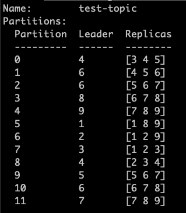
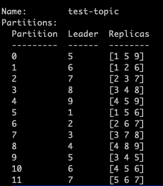

I work in the Data Engineering team in Gojek, and my work involves managing lots of Kafka clusters, among other kinds of stuff. This blog is inspired by a recent outage in one of our Kafka cluster, causing degradation in the consumer applications. As a resort, we had to scale up the Kafka cluster horizontally. This blog will acquaint you with horizontally scaling up a Kafka cluster, spotlighting partition reassignment.

Due to a high load on the cluster, we were facing high CPU on few brokers. We had an option to either increase the computing power on each broker simply by replacing them with powerful machines, i.e. vertical scaling. Vertically scaling a Kafka cluster means replacing existing broker nodes with higher capacity nodes while keeping the same brokers.

But there are a few challenges when you do that. For example, it involves careful re-consideration of the broker configs to use the new compute power optimally. Over-provisioning of computing and storage resources to the cluster can be quite costly to the business. We didn't want to put much effort into recalibrating our broker configurations as per new machine specs to save some time in a critical production support issue. So we decide to go for horizontally scaling the Kafka cluster.

Our Kafka brokers are usually standard Google Compute Engine instances. The broker configurations are defined in reusable IaC modules so that many teams can benefit from these well-thought configurations. All you need to do is provision your brokers using the IaC tool. In the Data Engineering team, we heavily use Terraform for IaC provisioning.

## Process

Horizontally scaling the Kafka cluster involves these rough steps:

1. Create new machines provisioning storage, networking, and compute resources
2. Start the brokers with your chosen configurations and provisioned resources
3. Reassign partitions across the cluster so that the new brokers share the load and the cluster's overall performance improves

Steps 1 and 2 can be challenging, time-consuming, error-prone and tricky when you don't have a standard way of creating new machines and provisioning them with necessary software and configurations. The Data Engineering team has diligently put lots of effort into achieving these standards across any deployment landscape, be it containers or virtual machines. It gives us exponential benefits saving a lot of time, avoiding configuration drift and human errors. So here, the only thing left to figure out was _reassignment of partitions_.

Before scaling up, the cluster had six brokers and ~1600 topics. As you might know, Kafka topics are further split into partitions to load balance. Brokers store these partitions. Brokers replicate partitions as per the replication configuration. If you are interested in a refresher, I've written about these concepts [here](https://abhisheksah.xyz/what-makes-kafka-awesome/). When you add new brokers, you also need to manually rearrange the partitions across the cluster so that the new brokers can balance the load evenly across all brokers.

For each partition of a topic, one broker gets elected as leader of that partition, and a few brokers participate in replicating that partition. So, for example: for a Topic T with replication factor 3, a partition Pi is distributed among Broker 1 as leader and Broker 2 and 3 as followers. When you run reassignment on this topic, leaders and followers will get modified.

Let's see a detailed example. The image below shows a topic `test-topic` with 12 partitions and a storage plan across nine brokers.



_After running partition reassignment:_



As you can see, the Kafka controller node readjusted the partitions storage to different brokers. Initially, the Kafka controller node stored Partition 0 on brokers 3, 4 and 5, with 4th as the leader. After the reassignment, it got stored on 1, 5 and 9 with the 5th broker as the leader.

When adding new brokers, the partition reassignment will ensure that the partitions of topics are balanced across the brokers, including the ones we added as part of scaling. We need to do this on all the topics for optimal load balance across newly added brokers.

## Execution

Now let's have a quick look at how to go about doing the reassignment.

The standard Kafka installation has the required script to run the reassignment. It can be found as `bin/kafka-reassign-partitions.sh`.

The reassignment is a 3 step process:

1. First, we put the list of topics we want to load balance in a JSON file.

```json
{
  "topics": [
    {
      "topic": "test-topic"
    }
  ],
  "version": 1
}
```

2. We tell the Kafka cluster to generate a plan for us. It will log to console, the current partition replica assignment and proposed partition reassignment configuration

```sh
bin/kafka-reassign-partitions.sh \
--bootstrap-server "my-kafka.example.com" \
--broker-list "1,2,3,4,5,6,7,8,9" \
--topics-to-move-json-file "/root/topics.json" \
--zookeeper "my-zookeper.example.com" \
--generate
```

Put the proposed partition reassignment configuration in a JSON file.

3. We execute the assignment on the proposed plan.

```sh
bin/kafka-reassign-partitions.sh \
--bootstrap-server "my-kafka.example.com" \
--reassignment-json-file "/root/plan.json" \
--zookeeper "my-zookeper.example.com" \
--execute
```

The execution time depends on the size of the topic, and it happens asynchronously. You can query the state of this execution by verifying.

```sh
bin/kafka-reassign-partitions.sh \
--bootstrap-server "my-kafka.example.com" \
--reassignment-json-file "/root/plan.json" \
--zookeeper "my-zookeper.example.com" \
--verify
```

## Next steps

Doing partition reassignment _manually_ for a big cluster having thousands of topics is time-consuming. As a next step, we are looking to develop automation to do the partition reassignment with minimal intervention.
