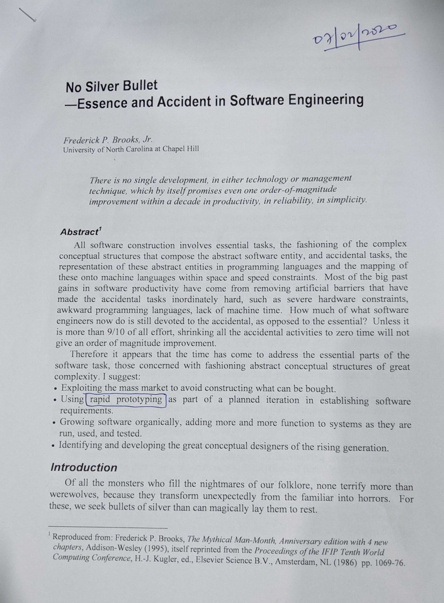

This week I spent some time finding and reading about classical textbooks and papers in software engineering so far. This blog post is about one of those highly esteemed papers written, titled [“No Silver Bullet — Essence and Accident in Software Engineering”](http://worrydream.com/refs/Brooks-NoSilverBullet.pdf) by Fredrick P. Brooks. This paper was written and published in 1986. Even after 34 years, this paper is widely discussed in the field of software engineering.

As we have known that in the field of hardware(electronics) there has been a two-fold increase in the number of transistors that can be put on an IC every two years. This is referred to as [Moore’s law](https://en.wikipedia.org/wiki/Moore%27s_law). Fredrick argues that there is no single development technique which by itself promises even one order-of-magnitude improvement within a decade in productivity or in reliability or in simplicity in software engineering. There is neither any management technique as well which promises such improvements. There are no silver bullets in software engineering.

But why is this case with software engineering? Fredrick analyses the intrinsic nature of the whole process that is “Software engineering” to find out why it is so. He finds two kinds of difficulties or complexities in software engineering. One is Essential difficulty and another is Accidental difficulty. Let’s go through each one by one.

### Essential difficulties

Fredrick goes on writing that the very nature of software is the root cause that there is no silver bullet. And this only makes it unlikely that there will be any silver bullet in future. We cannot expect any silver bullets in this field of ours. The essence of complexity in software engineering lies in data sets, relationships among those data sets, algorithms and invocation of functions. But the hard part of building software lies in specification, design and testing. There will always be syntax errors and need for improvement in the code, but they are tiny things compared to the bigger things like unclear specification, design flaws and loose testing.

Software is perhaps much more complex than any other human construct because no two parts are alike. In this aspect, Software shows acute differences from hardware, automobiles or buildings etc. Scaling-up a Software entity is not merely a repetition of the same elements in a larger size rather it is an increase in the number of different elements. The elements, in most cases, interact with each other in some non-linear fashion, and the complexity of the whole Software increase in much more than linearly.

From this complexity, comes the difficulty of communication among team members, leading to product flaws, cost overrun, schedule delays, the difficulty of enumerating, lesser understanding of all the possible states of the program and from that comes the unreliability.

Changeability is one other kind of intrinsic difficulty with Software. All the successful software gets changed(evolved) as time passes. As software is found to be useful, people try it in new cases at the edge of, or beyond, the original domain. The vehicle on which software rides(the underlying hardware) is changing at a very fast pace. The software has to live beyond the life of the hardware.

### Accidental difficulties

These are such difficulties which are not inherent to the domain but arise due to the interactions among the stakeholders and processes. There have been some developments in overcoming accidental difficulties in Software Engineering but these alone cannot promise order-of-magnitude improvements. Because they do not solve the inherent difficulties. Let’s go through some of the breakthroughs that solved accidental difficulties to some extent.

High-level languages are one such example. They have been the most powerful stroke for software productivity, simplicity, reliability and comprehensibility. High-level languages frees a program from much of its accidental complexity by providing abstractions over conceptual constructs. It eliminates a whole level of complexity that was never inherent in the program at all. But at some points, the high-level language becomes a burden, that increases the intellectual tasks of the user those esoteric constructs.

Unified programming environments like Unix have boosted productivity by integral factors. These integrated programming environments provide integrated libraries, unified file formats and piles and filters.

### Hopes for Silver bullets

Fredrick, next analyses, technical developments that are most often advanced as potential silver bullets. Ada and other programming languages solved some accidental difficulties by its philosophy of modularization and abstract data types. But surely, it will not prove as the silver bullet, as it another high-level programming language. Object-oriented programming looks like one more hope for a silver bullet to Fredrick. But object-oriented programming removes all the accidental difficulties from the expression of design. The complexity of the design itself is essential. And an attack on essential difficulties makes no change whatever in that. Similarly, Fredrick goes on discarding Artificial Intelligence, [Expert Systems](https://en.wikipedia.org/wiki/Expert_system), Automatic programming, Graphical Programming, Program Verification, Environment & Tools and workstations as silver bullets in Software Engineering.

### Attacks on Conceptual Essence

Fredrick goes on analysing some promising attacks on the essential complexity of Software. Buying software is one such approach instead of building it, as more and more vendors offer more and better software products for a variety of applications. They generally come with better documentation and somewhat better maintained than homegrown software. Better software has always shown remarkable improvement in productivity, for example, personal computers with well-generalized writing, drawing file and spreadsheet programs.

Precisely deciding what to build is the hardest single part of building software. Most of the times client also doesn’t know what they want to bet built. So in planning any software activity, it is necessary to allow for an extensive iteration between the client and the designer as part of the system definition. It is really impossible for clients to specify completely, precisely and correctly the exact requirements of a modern software product before having built and tried some versions of the product they are specifying. [Rapid prototyping](https://devsquad.com/blog/what-is-rapid-prototyping-and-why-is-it-used-in-development/) has been a very promising attack on this essence.

Software systems must be grown, not built. It should be grown in incremental development. The system should first be made to run, even though it does nothing useful except call some dummy subprograms. Then bit-by-bit it should be evolved into complex modules and function calls. Iterative development has shown dramatic results in projects. This also helps in building morale. Enthusiasm jumps when there is a running system, even a simple one.

The last piece of this analysis concerns with people. Fredrick argues, that we can get good designs by following good practices instead of poor ones. _Good design practices can be taught_. Unix, Pascal, Smalltalk, Fortran are some examples of software that are the products of one or a few great designers. Fredrick advocates that the most important single effort we can mount is to develop ways to grow great designers. No software organisation can ignore this challenge. Good managers are scarce but no scarcer than good designers. Great designers and great managers are both rare. Organizations should spend equal effort in finding and developing great designers as they do on management prospects. For those are the people upon whom the technical excellence of the products will ultimately depend. Fredrick proposes few suggestions to grow great designers. Like systematically identifying top designers as early as possible. The best designers are often not the most experienced. Assign a career mentor to be responsible for the development of the prospect, device and maintain a career development plan for each prospect and provide opportunities for growing designers to interact with and stimulate each other.

### Conclusion

Well, for starters, this paper convinces me of not searching for any silver bullets. Moreover, it gives a better perspective to me at how to look at software, in terms of Essential and Accidental difficulties. This mind shift change actually lowers the burden of thought process in a day to day basis. I shouldn’t fight or worry about the essence of Software. It happens most of the times to us that we get exhausted or frustrated with the problems while developing software. Thinking those difficulties in terms of essential and accidental is a huge thought process change. Complex/hazy requirements, non-linear interactions of different pieces are all inherent to Software. I think this is both the beauty and the curse of this field.

---

Inspired from the paper, next I have picked the [Mythical Man-Month (anniversary edition)](https://blog.codinghorror.com/recommended-reading-for-developers/). A detailed blog on the book would follow later. Thanks for reading. Feel free to connect with me on [Twitter](https://twitter.com/whoAbhishekSah) for any conversations on this blog.
