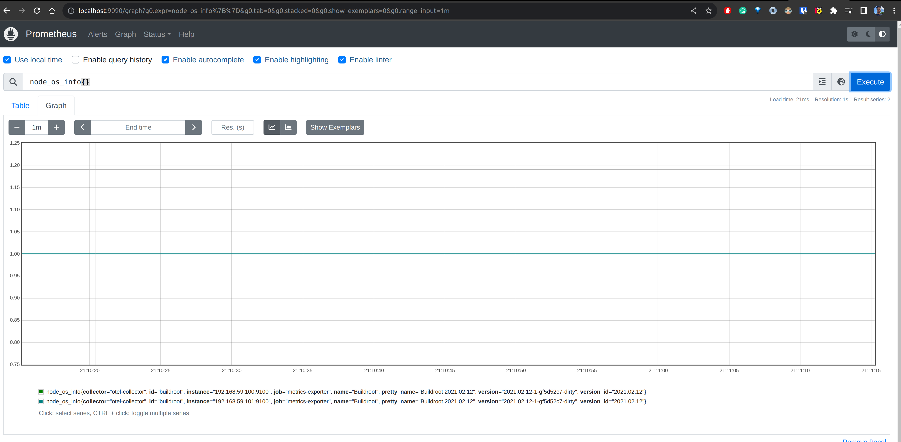

Open telemetry collector is one of the most popular CNCF projects attempted to receive, process and export telemetry data. At [Pixxel](https://www.pixxel.space/), we use OTEL Collector to discover targets in a k8s cluster, scrape metrics from configured endpoint and export the metrics to Grafana Mimir server. This is a mix of both push and pull approach. The pull part refers to discovering targets and scraping the endpoints. The push part refers to remote-writing the metrics to a Monitoring server.

An alternative way to achieve this setup is to run Prometheus in [agent mode](https://prometheus.io/blog/2021/11/16/agent/). But a major drawback I believe is fault tolerance. One prometheus pod per cluster(be it agent or normal mode) is a single point of failure. If that pod becomes unhealthy you may end up loosing metrics for the whole cluster. Although, it can be argued that these limitations can be overcome by proper resource/limit configuration to signal the priority of the pod to kubernetes cluster or by proper retry/buffer configuration, but that presents you with more ops work. Moreover, you may need to revisit these configuration as and when the workload increases in the cluster. It feels more ops work than a setup where we distribute the scraping workload to many replicas(daemonsets). Since Prometheus doesn't support a daemonset deployment, OTEL collector was a no brainer choice.

The following section describes how to configure the OTEL collector as daemonset. The fun part is leveraging Kuberneets service discovery with a node name filter. Since there weren't many good tutorials available on this deployment mode, I decided to write one :D

## Setup

Let's use the OTEL Collector [helm chart](https://github.com/open-telemetry/opentelemetry-helm-charts/tree/main/charts/opentelemetry-collector) to deploy it as Daemonset. I'll be using minikube for the below demonstartaion. Let's start a local kubernetes cluster with 2 nodes.

```
minikube start --nodes 2 -p local-k8s-cluster
```

Add Open-telemety repo to Helm:

```
helm repo add open-telemetry https://open-telemetry.github.io/opentelemetry-helm-charts
```

## Service Discovery

For each OTEL collector pod, we want to scrape only those pods that are running on the same node. We can acheive that in 2 steps:

1. Discover all pods using `kubernetes_sd_config`. We will need to provide clusterrole to our daemonset to discover nodes.
2. Filter using `nodeName` spec. [ref](https://kubernetes.io/docs/tasks/inject-data-application/environment-variable-expose-pod-information/).

```yaml
scrape_configs:
  - job_name: otel-daemon-scraping
    scheme: http
    kubernetes_sd_configs:
      - role: pod
        selectors:
          - role: pod
            # only scrape data from pods running on the same node as the collector
            # assuming KUBE_NODE_NAME env will be set in collector pods env
            field: 'spec.nodeName=${env:KUBE_NODE_NAME}'
```

With the nodeName field selector filter, we can pick only targets on the same node. The node name is read from env variable(assuming it is set in env of the pods during provisioning). Prometheus doesn't support env variables in config file which limits its usage as daemonset(in agent mode).

After the pods have been discovered on each node, we need a way to find the port number and path on the pods to scrape metrics. It can be acheived by leveraging pod labels/annotations. OTEL Collector provides the pod label and annotations inside metric label for that target, which we can read and take required action using relabeling(`relabel_configs`):

```yaml
relabel_configs:
  # scrape pods annotated with "prometheus.io/scrape: true"
  - source_labels: [__meta_kubernetes_pod_annotation_prometheus_io_scrape]
    regex: true
    action: keep
  # read the port from "prometheus.io/port: <port>" annotation and update scraping address accordingly
  - source_labels:
      [__address__, __meta_kubernetes_pod_annotation_prometheus_io_port]
    action: replace
    target_label: __address__
    regex: ([^:]+)(?::\d+)?;(\d+)
    # escaped $1:$2
    replacement: $$1:$$2
```

The first item in the `relabel_configs` array checks for presence of the annotation `prometheus.io/scrape: true` on the discovered target. Only those targets are kept which match the regex specified in the `keep` block. `keep` and `drop` actions allow us to filter out targets and metrics based on whether our label values match the provided regex. The second item in the array, configures the host and port of the target. The `scheme` sets to `http` by default and path to `/metrics`. The configs can be overridden by relabelling.

So far, we have established the receiver configurarion of the OTEL Collctor. To complete the demonstaration, end to end, I will run a Prometheus Server where our collector pods will write the metrics. We can setup a grafana instance to query from this server.

## Metric storage with Prometheus

Here is a kubernetes manifest to create a prometheus deployment enabled with remotewrite, exposed via a K8s Service.

```yaml
# prometheus.yml
apiVersion: v1
kind: ConfigMap
metadata:
  name: prometheus-server-conf
data:
  prometheus.yml: |-
    global:
      scrape_interval: 5s
      evaluation_interval: 5s
    scrape_configs:
---
apiVersion: apps/v1
kind: Deployment
metadata:
  name: prometheus
  labels:
    app: prometheus-server
spec:
  replicas: 1
  selector:
    matchLabels:
      app: prometheus-server
  template:
    metadata:
      labels:
        app: prometheus-server
    spec:
      containers:
        - name: prometheus
          image: prom/prometheus
          args:
            - '--storage.tsdb.retention.time=12h'
            - '--config.file=/etc/prometheus/prometheus.yml'
            - '--storage.tsdb.path=/prometheus/'
            - '--enable-feature=remote-write-receiver'
          ports:
            - containerPort: 9090
          volumeMounts:
            - name: prometheus-config-volume
              mountPath: /etc/prometheus/
            - name: prometheus-storage-volume
              mountPath: /prometheus/
      volumes:
        - name: prometheus-config-volume
          configMap:
            defaultMode: 420
            name: prometheus-server-conf
        - name: prometheus-storage-volume
          emptyDir: {}

---
apiVersion: v1
kind: Service
metadata:
  name: prometheus
spec:
  selector:
    app: prometheus-server
  ports:
    - protocol: TCP
      port: 9090
      targetPort: 9090
```

Apply the above helm override to our cluster.

```
kubectl apply -f prometheus.yml

```

After applying the above file to our cluster we will have a working Prometheus deployment ready to accept remote writes. It is exposed via a kubernetes service which can be accessed via this DNS:
`http://prometheus.default.svc.cluster.local:9090`

### Collector config

Now is the time to push some data to Prometheus. Let's deploy our OTEL collector with proper config using the below helm override file.

```yaml
#otel-override.yaml
#ref: https://github.com/open-telemetry/opentelemetry-helm-charts/blob/main/charts/opentelemetry-collector/values.yaml
mode: 'daemonset'
extraEnvs:
  - name: KUBE_NODE_NAME
    valueFrom:
      fieldRef:
        fieldPath: spec.nodeName

config:
  exporters:
    logging:
      verbosity: detailed
    prometheusremotewrite:
      endpoint: http://prometheus.default.svc.cluster.local:9090/api/v1/write
      external_labels:
        collector: otel-collector

  receivers:
    prometheus:
      config:
        scrape_configs:
          - job_name: metrics-exporter
            scheme: http
            kubernetes_sd_configs:
              - role: pod
                selectors:
                  - role: pod
                    # # only scrape data from pods running on the same node as prometheus
                    field: 'spec.nodeName=${env:KUBE_NODE_NAME}'
            relabel_configs:
              # scrape pods annotated with "prometheus.io/scrape: true"
              - source_labels:
                  [__meta_kubernetes_pod_annotation_prometheus_io_scrape]
                regex: true
                action: keep
              # read the port from "prometheus.io/port: <port>" annotation and update scraping address accordingly
              - source_labels:
                  [
                    __address__,
                    __meta_kubernetes_pod_annotation_prometheus_io_port
                  ]
                action: replace
                target_label: __address__
                regex: ([^:]+)(?::\d+)?;(\d+)
                # escaped $1:$2
                replacement: $$1:$$2

  service:
    pipelines:
      metrics:
        receivers: [prometheus]
        exporters: [prometheusremotewrite]

clusterRole:
  create: true
  rules:
    - apiGroups: ['']
      resources:
        - pods
      verbs: ['get', 'list', 'watch']

  clusterRoleBinding:
    name: 'otel-discoverer'

ports:
  otlp:
    enabled: false
  otlp-http:
    enabled: false
  jaeger-compact:
    enabled: false
  jaeger-thrift:
    enabled: false
  jaeger-grpc:
    enabled: false
  zipkin:
    enabled: false
  metrics:
    enabled: false
```

This can be applied to cluster: `helm install otel-collector open-telemetry/opentelemetry-collector -f otel-override.yaml`

Let's go through some important aspects of this helm override:

1. We set the deployment to daemonset and add extra env var to capture the nodename on each daemon pod of OTEL Collector.

2. The metrics pipeline is built using `prometheus` receiver and `prometheusremotewrite` exporter defined in their respective sections. If you are not familiar with receivers and exporters, here is a [reference](https://opentelemetry.io/docs/collector/configuration/).

3. The receiver has rules for pod discovery using pod annotations. It picks only those pods which are running on the same node, using nodeName field selector. The nodeName is specified in a templated way `spec.nodeName=${env:KUBE_NODE_NAME}` which will render to nodename during runtime.

4. The exporter writes to prometheus server at it's remotewrite endpoint. It also places a label `collector: otel-collector` in all the series. Such "global" labels can be crucial when running multiple kubernetes clusters in same/different cloud accounts(AWS Account/GCP project) etc.

5. The required cluster role and binding is specified to discover pods.

6. We have not opened the OTEL Container Ports that are not needed in the scope of this article.

With all workloads created(Node Exporter daemon, OTEL Collector daemon and prometheus pod), this is how the cluster should look like:

```shell
➜  kubectl get pods
NAME                                                 READY   STATUS    RESTARTS   AGE
node-exporter-prometheus-node-exporter-h2vxr         1/1     Running   0          7m
node-exporter-prometheus-node-exporter-kcds4         1/1     Running   0          7m
otel-collector-opentelemetry-collector-agent-9rxm7   1/1     Running   0          5m1s
otel-collector-opentelemetry-collector-agent-mbq6x   1/1     Running   0          5m1s
prometheus-5b54c7c696-4kzjj                          1/1     Running   0          6m4h
```

### Querying data

If everything goes right, you should be able to see the data from node_exporter daemons in prometheus. The simplest way to query would be pop up the prometheus UI on your browser and query for some data.

You can access the Prometheus UI on your browser by port-forwarding the Prometheus kubernetes service: (make sure your port 9090 on your local machine is free to use)

```
k port-forward svc/prometheus 9090:9090
```

Navigate to http://localhost:9090 and execute the query shown in the image below. Verify if you are getting 1 timeseries row per node_exporter.



We can also spin up a Grafana instance for better visualation: Port-forward Prometheus service locally and add the localhost:port as Data Source(also called Connections) in this grafana instance.

### Debugging

If something doesn't work as expected you can use debug logs to see the errors.

1. OTEL collector debug log : Modify the "service" section to add debug config.

```yaml
service:
  telemetry:
    logs:
      level: "debug"
  pipelines:
    metrics:
      receivers: [prometheus]
      exporters: [prometheusremotewrite]
```

2. Prometheus debug logs can be enabled via the flag `"--log.level=debug"` in the `spec.containers.arg` list

---

To recap, we looked into how to deploy OTEL collectors as daemons on a kubernetes cluster and discover pods local to collectors node. We also looked into how to export these metrics to a remote server and visualize the metrics. At the end we looked into how to debug, in case things don't work as expected. That's all I had to document for OTEL Collector usage. Stay tuned for more blogs!
