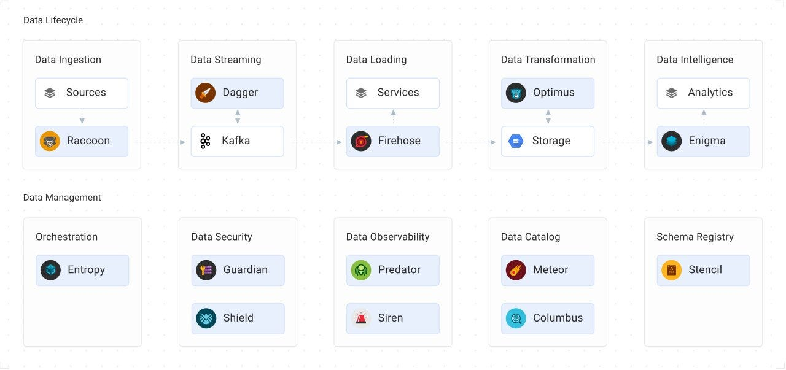
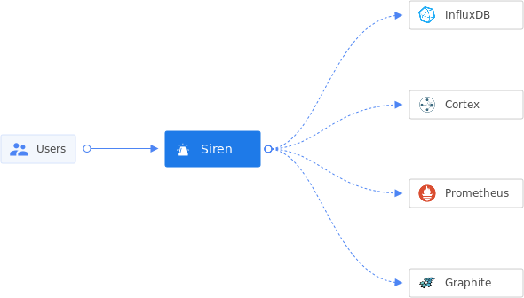
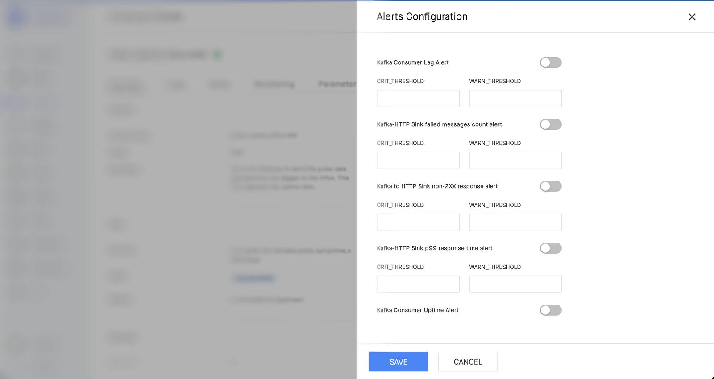
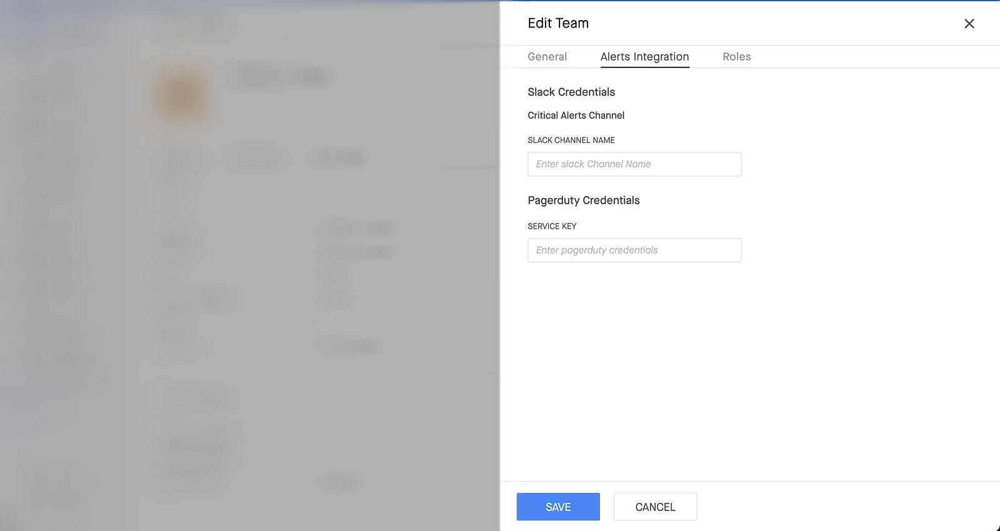

This blog takes inspiration from a significant project I undertook at Gojek in 2021. It has been pending publication for a while, mainly due to my lack of diligence 🙈 . However, I have now resolved to be more active in blogging, starting with the unpublished drafts I have accumulated. Without further ado, let’s dive into it.

<hr>

Siren is an orchestrator for alerting, written in Golang and open-sourced under [Raystack](https://github.com/raystack/siren) community developed at Gojek Data Platform team back in 2021.

The Gojek Data platform team provides various offerings to Gojek's engineering teams in order to make their data journey hassle-free and self-serve. The team enables engineers to ingest, process, operate and consume data with just a few clicks of buttons. This is achieved via a suite of products, serving use cases in the data lifecycle viz: ingestion, loading, transformation, intelligence, analytics, and so on.

A snapshot of range of products that build the data-experience:



Among the various products available for supporting these use cases, Siren stands out in the operations domain. Siren enables developers to monitor the well-being of these products by placing alerts on their data pipelines. Now, let's delve into the process of accomplishing this.

## Introduction 

Alerts are integral part of any observability pipeline. Once the automated system detects any anamoly in the system, it can trigger an alert, informing humans about it. Alerts can be defined on the metrics that developers care about. e.g

- Being alerted when a Kafka broker is degraded e.g. CPU usage is high or disk filled etc.
- High consumer lag can cause the degradation of other dependent services.
- Jobmanager of some Flink cluster becomes unhealhty.
- Sudden traffic increase on a service which demands resource resizing

Siren can be used to develop such alerting pipelines. The following will get into the details of how Siren achieves this, by first laying some foundation of how alerting works, in general.

With alerting, the aim is to notify via appropriate channels(Slack or Email or Pagerduty, etc.) when some event occurs(mostly bad events) so that developers are aware of the degradation and can take actions accordingly, well within time.

For that, you're required to first collect the health data of the system under observation. This is typically done by some monitoring server(e.g. Prometheus, Influx, etc.). You also set alerts on top of the collected metrics. Siren can be used to configure alerts inside the monitoring servers.
Monitoring Servers are referred to as ["Providers"](https://raystack.github.io/siren/docs/guides/provider_and_namespace) inside Siren. There are two ways of collecting health data, push and pull-based.

Monitoring servers provide ways to define alert conditions on top of this data. Think of it as a continuous evaluation of a script over a window of data. One example of such a script is: Check if the CPU usage percentage is higher than 85% over a window of the past 10 minutes.

Once the data is stored by the monitoring server, and the alerts scripts(also called rules) are set, they are evaluated periodically on this data by the monitoring server. If the specified conditions match, an alert notification is sent in the configured notification mediums(ex. Email, Slack etc). Below is a dummy architecture diagram of this flow.


Siren provides the abstraction for defining alert conditions via ["Rules"](https://raystack.github.io/siren/docs/guides/rule) and routing configuration via ["Subscriptions"](https://raystack.github.io/siren/docs/guides/subscription) for a variety of monitoring providers. _It lets users define alert conditions and configurations for where to route when those alerts trigger._

## Siren Alert Configuration

Siren is written in Golang and [open-sourced](https://github.com/raystack/siren) under Raystack. Currently, it supports alert management for [Cortex metrics](https://cortexmetrics.io/). We plan to add more monitoring providers e.g. Prometheus, Grafana Mimir, Thanos etc. (Your contributions are most welcome 🙏)



In order to create alerts in a monitoring provider(e.g. Cortexmetrics) Siren needs you to define a ["Template"](https://raystack.github.io/siren/docs/guides/template). The template has the alert body in the syntax as supported by the corresponding monitoring provider. In Prometheus compatible monitoring providers(Cortexmetrics, Thanos, Mimir etc) alert body is a yaml with 5 required keys: `alert`, `expr`, `for`, `labels`, and `annotations`. The template given below holds an array of templatized alerts of critical and warning severity.

Think of templates as a blueprint for your actual alerts. Here is an example template that can be used to create alerts on CPU usage.

```yaml
apiVersion: v2
type: template
name: CPU
body:
  - alert: CPUWarning
    expr: avg by (host) (cpu_usage_user{cpu="cpu-total"}) > [[.warning]]
    for: '[[.for]]'
    labels:
      severity: WARNING
    annotations:
      description: CPU has been above [[.warning]] for last [[.for]] {{ $labels.host }}
  - alert: CPUCritical
    expr: avg by (host) (cpu_usage_user{cpu="cpu-total"}) > [[.critical]]
    for: '[[.for]]'
    labels:
      severity: CRITICAL
    annotations:
      description: CPU has been above [[.critical]] for last [[.for]] {{ $labels.host }}
variables:
  - name: for
    type: string
    default: 10m
    description: For eg 5m, 2h; Golang duration format
  - name: warning
    type: int
    default: 80
  - name: critical
    type: int
    default: 90
tags:
  - systems
```

This template is evaluated by [go-templates](https://pkg.go.dev/text/template) with `[[ ]]` being the delimiter. As you can see, in the list of variables, `for` , `warning` and `critical` have been templatized. The user needs to give value to these variables during alert creation. After a valid request payload, an alert will be created by Siren. This alert can be further enabled/disabled using Siren APIs.

Templates are used for reusability. A generic template (like the one shown above) can be used by multiple teams in multiple environments (i.e. dev, prod etc.) without any alert "configuration drift". So based on the needs, teams can define their templates and create alerts from them using Siren APIs, instead of rewriting the same alert rule every other time.

Templates allow us to simplify alerting pipeline it to an extent that users don't even need to know all the details of the alerting rule because most of the complexity is abstracted out by the Siren APIs. It is done by creating an alert marketplace of sorts, where people can read the description of the alert and provide just enough input to create the alert on their data pipeline. Here is a snap of this beauty:



After the Save button click, this user interface calls Siren Rules PUT API with the input provided by User. Siren identifies the appropriate provider and configures these alerts inside it. The same alerts can be edited again and again, like disabling and enabling with the thresholds preserved and changing thresholds etc.

With the primary use-case of alert management being solved, we looked for an elegant developer experience where we provide a CLI interface and Gitops model of alert management. 

These interfaces are quite popular with teams that need alert management in bulk. The rules are uploaded in a git repo and a CI pipeline ensures corresponding alerts are set in the monitoring server in the exact same way. Read more about it [here](https://raystack.github.io/siren/docs/guides/rule#use-case-ci).

## Siren Alert Routing Configuration

Siren also provides a way to define the routing of the triggered alerts in a similar fashion. 

As we know, the monitoring server continuously evaluates the alerts and sends a notification when it triggers. So, there needs to be an appropriate configurations set with the required authorization in order to send out those notifications. For Prometheus and Cortexmetrics type providers, these configs are set into [Alertmanager](https://prometheus.io/docs/alerting/latest/alertmanager/). All of it can be done via Siren in a self-serve way using Siren. Here is an example of how we let users define alert routing in a UI.



Siren handles the internals to map these configs to the appropriate team, so that any alert owned by a team, reaches these channels when triggered. This is achieved by Siren's [Subscriptions](https://raystack.github.io/siren/docs/guides/subscription). You "subscribe" to alerts by defining "matchers" on [receivers](https://raystack.github.io/siren/docs/guides/receiver).

The "matchers" are a set of conditions(key-value pair, kind of a label selectors of k8s) that must match on a given triggered alert for the subscription to be selected for alert routing. Receivers are an abstraction for actual notification medium with authorization support baked in. Like a slack receiver, that holds the auth-token so that alerts can be routed in the slack channels.

For example, the image above configures alert routing for a [Firehose](https://github.com/raystack/firehose) deployment called example-firehose. The matching conditions roughly translate to:

Whenever some alert has `severity: critical`, `team: exampleTeam`, `deployment: example-firehose` the alert will be routed to two receivers:

1. Slack with channel name as given in user input
2. Pagerduty with service key given in input.

Using subscriptions, you can define any matching condition and pick receivers to handle the routing. Siren subscriptions also abstract out the complexity of alert routing configuration for many providers(e.g. Cortexmetrics, Influx, etc.) via a single API interface.

To my knowledge, in production, it manages the configuration of approximately 1500 alerts and the routing of around 90 teams. By utilizing Siren, we ensure the overall health of services & products within the data platform.

---

That was a high-level overview of the functionality provided by Siren. We encourage you to share your comments and ask any questions you may have 🙌. Additionally, you can access the Siren [documentation](https://raystack.github.io/siren/), which offers detailed explanations of concepts, terminologies, database schema, API contracts, usage guidelines, and various other informative guides.

Siren is currently in its early stages, and we are eagerly anticipating its potential impact on the open-source community. Our goals include expanding support for multiple monitoring providers and tackling challenging use cases, like enabling alert subscriptions without dependency on internal IAM policies. 

If you're interested in contributing, we invite you to explore the list of [good first issues](https://github.com/raystack/siren/issues?q=is%3Aissue+is%3Aopen+label%3A%22good+first+issue%22).
available. Your contributions would be highly valued and appreciated. Thanks for reading!
