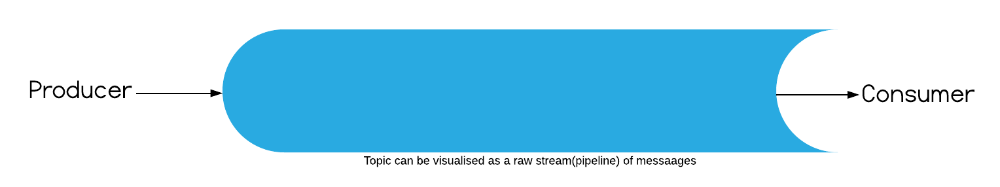
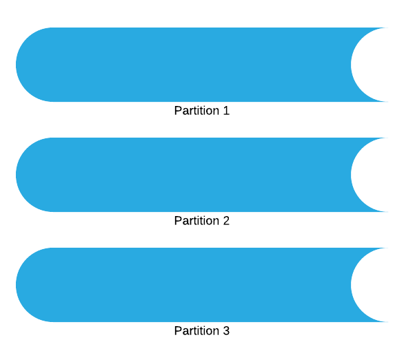
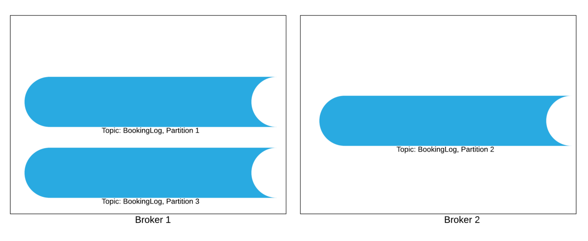
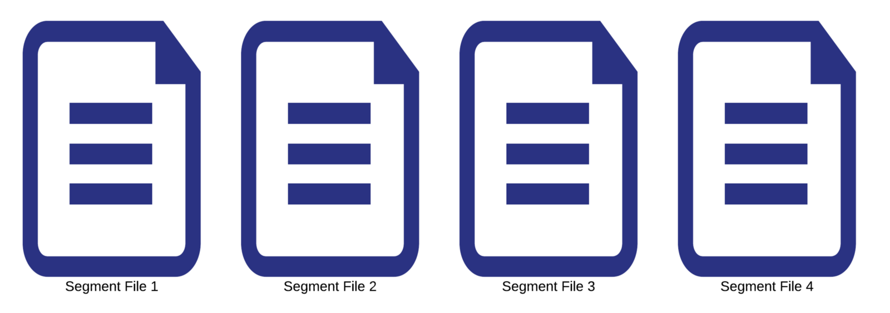
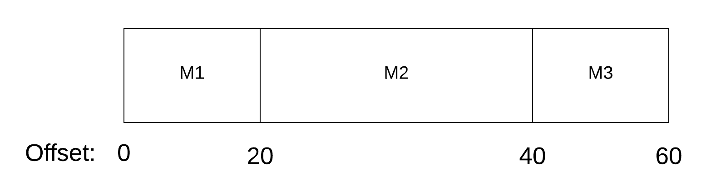
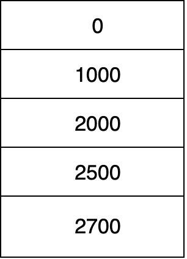

[Kafka](https://kafka.apache.org/) is one of those software that are in the foundations of most of the data-driven companies e.g. LinkedIn, Uber, Spotify, Slack etc. Kafka solves the problem of high throughput real-time data pipelining with minimal latency. It's flexible and lean architecture has helped companies scale massively without worrying about the quality and latency of the data pipeline. In this blog, we will go through internals of mighty Kafka and will find out what makes Kafka so awesome.

Let's begin with a subtle introduction.

## What is Kafka

Kafka is mainly a Log processing application. By log, we mean any form of raw data or event that needs to be stored for later processing. For example, user activity events(page views, button clicks, logins, signups, likes, comments etc.) or operational metrics such as errors in applications, crashes, system usage etc. This processing can be either real-time or offline.

Why do we need to store these raw data/events in the first place?

Because this helps data-driven companies make efficient decisions. Companies can use this data to improve their search relevance, recommendation systems, and target appropriate ads to customers.

This data, nowadays, can be of enormous volume. Think of the scale at which social media giants like Facebook, LinkedIn operate and storing all major events done by users on their website and mobile applications. This becomes billions of events every day.

Storing these enormous data without compromising throughout is no simple job. Kafka is very good at this(we will see how). Moreover, Kafka gives you the ability to perform real-time processing on this data. One example of such real-time processing is calculating [surge pricing](https://www.davemanuel.com/investor-dictionary/surge-pricing/) in apps(like Uber).

Surge pricing is calculated by taking into consideration the current demand and current supply. These two metrics are used in real-time to calculate how much surge price to add to the trip. For example, Surge price in Uber during rains in the evening.
The real-time usage of log data brings several challenges. One of which is high throughput. Kafka gives the ability to perform such real-time processing with minimal latency. Kafka is scalable, distributed, supports high throughput, supports real-time consumption of data and provides a [rich set of APIs](https://kafka.apache.org/documentation/#api) to make developers life easy.

## Kafka Architecture

Kafka's architecture is fairly simple. There are a few logical concepts that you need to understand in order to deep dive into Kafka. Kafka runs on [Pub/Sub Model](https://aws.amazon.com/pub-sub-messaging/). Which means, there are entities which produce messages and put in some designated places and there are entities which subscribe to these places.

Topic: Stream of messages of a particular type is called a topic. For example, a BookingLog Topic for Uber will keep all messages of trip booking type made on the Uber app.

Producer: The entity which produces messages to a topic. The producer application constructs the messages and sends it to Kafka to store that message in a particular topic.

Broker: Brokers are servers where the published messages are stored.
Consumer: The entity which consumes data that was put in a topic(from the Brokers). Consumers consume messages inside a topic from Broker via a bridge called Message Streams.

Given these basic terminologies, you would have guessed the basic flow of data in Kafka.

Producers produce messages(data) in topics. Brokers store those data. Consumers can consume data from these topics.

Topics can be of very high throughput depending on the use cases. BookingsLog alone is a very high throughput topic if you think about Uber's scale. So to balance the load, Topics are further divided into Partitions.

Each broker stores one or more partitions of various topics.

Topic BookingLog split into 3 partitions & stored on 2 brokersPartitions of a topic are simply Log files. Think of all the partitions of a topic as a file on the storage system of the Brokers. Depending on the usage, this partition's(Log file's) size can vary. It can be very large for some high throughput topics. So it is [split](http://man7.org/linux/man-pages/man1/split.1.html) into multiple smaller files, called Segment Files.

A partition now logically looks like:

Partition P2 split into 4 segment FilesLet's say Partition P2 is the set of segment files S1, S2, S3 and S4. Any new message produced to Partition P2 will be written to the last segment file(here, say, S4).
This is to be noted that, at first the segment file lives in the memory of a broker. After a predefined threshold is reached, then only the segment file is flushed to the disk i.e. written on the secondary storage. There are two such predefined thresholds:
A certain number of messages have been published from the publisher of that partition.
Certain time has elapsed since last published event.

The messages are only exposed to consumers when they are written to the disk. Messages residing in the memory of Brokers are never exposed.

### Message format

Every message in Kafka is stored with an offset. This is so because the messages can be of varying size. So offset is decided by the size of the messages in the segment files.

For example, Let's say for segment file S1, three messages came from the producer which are of size 20bytes, 40 bytes and 20 bytes.
Then the ordering of message in segment file with offset typically looks like the image below with offset of M1 as 0, offset of M2 as 20 and offset of M3 as 40.

A typical order of messages inside a segment file. Here you can see the offsets are in increasing order but they are not consecutive.

Normal, message queue systems (such as RabbitMQ) use message ID instead of offset. The message ID does the one-to-one mapping of Message's location on disk. This allows the user to do random indexing of the messages. Random access to messages is a [seek](https://www.geeksforgeeks.org/difference-between-seek-time-and-rotational-latency-in-disk-scheduling/) intensive operation. This is a costly IO operation affecting latency. Kafka avoids using message IDs.
Offsets are also used as consumers acknowledgements. If a consumer acknowledges an offset x, it is assumed that the consumer has consumed all messages with offset < x.

### Managing partitions on the broker

It's time to understand how brokers store and manage any partition. As we have understood, partitions are a set of segment files. Every segment file starts with some message. Every message is identified with a message offset.

Brokers store a sorted table in memory which basically keeps the first offset of each segment file.

Let's see it this way. Let's say for partition P1, there are 5 segment files(S1, S2, S3, S4 and S5). The first message in S1 has offset 0. Likewise, first messages of files S2, S3, S4 and S5 have offsets 1000, 2000, 2500 and 2700 respectively.

The broker will store an in-memory table which keeps the offset of the first message in each segment file. Here : 0, 1000, 2000, 2500, 2700

Table of starting offset of each segment fileAny new message which comes, if stored in S5, won't affect this table. As soon as, a new segment file appears, this table will be updated with the offset of the first message in the new segment file.
This table is used to find the segment file which contains the offset asked by the consumer.

### Consumption of messages

Consuming messages is fairly simple. This is a 4 step process. 
Consumers send a pull request to brokers. In this request, there are two things. Consumers specify the offset to begin with, and an acceptable number of bytes in the messages.
Broker on receiving the offset to begin calculates which segment file has the message with asked offset. Simple binary search on the above table gives the address of the segment file to which the message belongs.
Broker fetches the data from that segment file and sends to the consumer.
The consumer consumes this data.

The consumer sends the next offset in the new pull request.

### Efficiency of Kafka

Kafka is considered the best real-time message log system. There are several design decisions(rather unconventional) which make Kafka so efficient.

#### Storage Efficiency

The first one is the use of offsets instead of message-ids which saves the cost of seek intensive random accesses. On top of that, keeping an index of the offsets of starting message in each segment file makes consumption from a partition fairly efficient.

The second unconventional choice that we see in Kafka is avoiding any caching in Kafka Layer. Kafka avoids caching every message in memory at the process level. Instead, it relies on the underlying file system cache. This offers multiple benefits.

First, it avoids double buffering. Modern operating heavily use main memory for disk caching. A modern OS will happily divert all free memory to disk caching with little performance penalty when the memory is reclaimed. All disk reads and writes will go through this unified cache. So even if a process maintains an in-process cache of the data, this data will likely be duplicated in OS page cache, effectively storing everything twice. Although there could be a debate on when and how to process level caching is useful. Read this [ACM article](https://queue.acm.org/detail.cfm?id=1563874) for a thorough analysis.

Second, this cache(the file system cache) will stay warm even if the broker service is restarted, whereas the in-process cache will need to be rebuilt in memory.

The third benefit is that no cache at process level means, less overhead in Garbage collection, giving efficiency in VM based languages.

The fourth benefit comes from the use of traditional caching heuristics like write-through cache. Since both consumer and producer access the segment files sequentially, normal caching heuristics present in most OS works fine.

#### Network Efficiency

Consumption of messages from the File system involves fetching message from secondary storage and sending all the way to network sockets. This typically involves reading data from the storage to page cache, copying page cache to application buffer, copying application buffer to kernel buffer and finally sending kernel buffer to a socket. This involves 4 data copying calls and 2 system calls.

Kafka uses the [sendfile API](http://man7.org/linux/man-pages/man2/sendfile.2.html) available in Linux which does the same thing in 2 data copying calls and 1 system call. This optimised API results in the fast consumption of data.

#### Broker's design efficiency

Kafka Brokers are stateless. It means that a broker doesn't know which consumer has consumed till what offset. The consumer itself keeps track of the offset. It reduces overhead from the Broker. But there are cons as well. Deleting messages becomes difficult since the broker doesn't know if all consumers have consumed that message. For this, Kafka gives a time-based SLA where retention policy can be configured for brokers.

Brokers being stateless gives a side benefit to consumers to deliberately choose to rewind back to an old offset and re-consume(if the messages have not exceeded retention period, of course). Though, it is a violation of queue but has proved as an essential feature. For example, if consumer application feeding on data from Kafka has some bugs, then the data can be replayed after the bug has been resolved.

### Distributed Consensus

Let's see how producers and consumers behave in a distributed setting.

The producers produce data to a topic stored in Brokers and consumers consumer from these topics. Producers need to decide which partition to produce data. A partition can be randomly selected by the producer or by using a partitioning function.
Consumers to a topic are put in a group called "Consumer Group". Each message m of Topic T is delivered to only one consumer in the consumer group. At any time, all messages from one single partition are consumed by a single consumer. Different consumer groups independently consume messages from topics. No coordination is required among them. But within a consumer group, coordination is required.

The leader inside a consumer group is decided by a separate entity called [Zookeeper](https://zookeeper.apache.org/). Kafka uses Zookeeper as a configuration store.
Zookeeper does these 3 things for Kafka.

- Detecting the addition and removal of brokers and consumers
- Triggering rebalance process in each consumer when the above event occurs
- Maintaining track of consumed offset of each partition.

Rebalancing, whenever required, is taken care of by zookeeper by running a rebalancing algorithm.
Kafka uses Zookeeper to maintain 4 types of registries(config stores)for various purposes. Let's quickly see what each registry stores.

Broker registry: Stores information about brokers. It stores the host and port of the broker and the set of topics and partitions stored in the broker.

Consumer Registry: Stores consumer group of each consumer and set of topics each consumer is subscribing.

Ownership Registry: Stores one path for every subscribed partition and the id of the consumer currently consuming for this
partition. This consumer is said to own the partition.

Offset Registry: Stores for each partition, the offset of the last consumed message.

The first three registries are ephemeral i,e. if the creating client is gone, these path created in corresponding registries is removed from by zookeeper server. Offset registry is persistent.

Each consumer has a watcher on both Consumer registry and Broker registry. Whenever broker set changes or consumer group changes or the startup of a consumer happens the watcher notifies consumers to initiate a rebalancing algorithm process. This is to determine new subsets of partitions it should subscribe from. To learn more about the rebalancing algorithm, read this manual.

### Delivery Guarantee

Kafka only guarantees at least once delivery. By design, they didn't want to go for the exactly-once guarantee, because that would have retired efforts in two-phase commits which were not necessary requirement for Kafka.

Kafka also doesn't guarantee to order of the messages. Since messages go to different partitions, can be consumed from different partitions as per the consumers want. So there is no inherent ordering of messages by design in Kafka. Consumers itself will have to take care of the ordering of the messages.

Kafka also takes care of the data corruption by giving Cyclic redundancy check at the message level. This allows you to check network error.

---

This blog was inspired by the [Kafka white paper](https://www.microsoft.com/en-us/research/wp-content/uploads/2017/09/Kafka.pdf). I would suggest the readers explore [this wiki](https://cwiki.apache.org/confluence/display/KAFKA/Kafka+papers+and+presentations) to learn more detailed concepts about Kafka. Thanks for reading. Feel free to connect with me on [Twitter](https://twitter.com/whoAbhishekSah) for any conversations on this blog.
